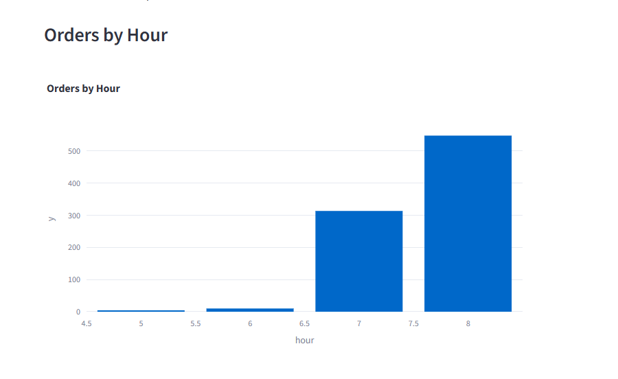

# 🚀 E-commerce Real-Time Order Processing

This project simulates an **e-commerce order processing system** using AWS services such as **Step Functions**, **Lambda**, **DynamoDB**, **S3**, and **API Gateway**. The system processes orders in real-time, from validation to storing the orders in DynamoDB and S3. It also detects high-value orders and triggers alerts via SNS. LocalStack is used to emulate AWS services locally.

---

## ✅ Tools Used

- **Python 3.11**
- **Boto3** (AWS SDK for Python)
- **LocalStack** (local AWS environment)
- **DynamoDB** (NoSQL database)
- **S3** (for storing order data)
- **Kinesis** (real-time stream processing)
- **Step Functions** (for orchestration)
- **Lambda** (for serverless computing)
- **Streamlit** (for interactive dashboard)
- **Plotly** (for data visualizations)
- **Docker** (for containerization)
- **API Gateway** (to simulate API requests)
- **Pandas** (for data manipulation and analysis)
- **json** (for JSON parsing)
- **uuid** (for generating unique identifiers)
- **Decimal** (for precision in financial calculations)
- **time** (for delays in real-time systems)

---

## 📦 Installation

### 1️⃣ Clone the repository

```bash
git clone https://github.com/kacperguzydev/ecommerce-order-processing.git
cd ecommerce-order-processing
```
### 2️⃣ Install required packages
```bash
python3 -m venv .venv
```
```bash
pip install -r requirements.txt
```
### 3️⃣ Install Docker and LocalStack
To run LocalStack locally, you need Docker installed on your machine. If you don't have it, follow the official Docker installation guide. then install docker-compose.yml
```bash
docker-compose up
```
### 4️⃣ Start All Setups

### 5️⃣ Start api_gateway.py and cloudwatch.py

## 🚀 Screenshots
- Monitoring:

- Athena Analyst Kpi


- Dashboard Kpi



